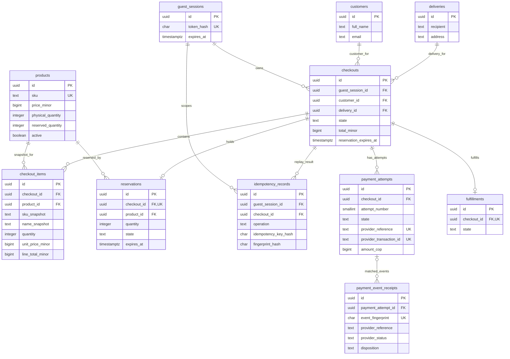

# Payment Flow Lab

A full-stack checkout system built as an engineering challenge and as a measured experiment in AI-assisted software delivery.

The repository implements a responsive React application, a NestJS API, PostgreSQL-backed inventory and checkout workflows, automated tests, and a reproducible AWS deployment. The API integrates with a sandbox payment provider through a backend adapter.

## Selected stack

- Frontend: React, TypeScript, Redux Toolkit.
- Backend: NestJS, TypeScript, Jest.
- Database: PostgreSQL.
- Runtime: AWS ECS on Fargate.
- Infrastructure as code: Terraform.

The API runs as one modular service. This keeps the challenge small enough to operate while preserving clear domain boundaries. Kubernetes and a microservice split are out of scope unless evidence changes that decision.

## Project status

I0-I9 implementation work is merged. The I7 acceptance audit found gaps; I8 addressed the checkout-flow gaps and added direct README coverage evidence. The [acceptance report](docs/i7-final-acceptance.md) records that audit, the I8 deployment, and its remaining verification limits. [PR #20](https://github.com/teraspace/payment-flow-lab/pull/20) added typed result flows for checkout and payment commands; its API image `i9-dc226ce` is deployed on ECS task-definition revision 6. The [I9 release ledger](docs/ai-sdlc-ledger.md) records ECS 1/1 and public app, health, database readiness, catalog, and Swagger checks returning HTTP 200.

The [deployed application](https://d2ump7odi96dfi.cloudfront.net) connects the CloudFront frontend to the Fargate API; the public [Swagger UI](https://d2ump7odi96dfi.cloudfront.net/api/v1/docs) documents its endpoints. CloudFront still serves the I8 frontend assets: the visual progress correction from [PR #19](https://github.com/teraspace/payment-flow-lab/pull/19) is merged but awaits a frontend deployment. [PR #21](https://github.com/teraspace/payment-flow-lab/pull/21) recorded I9 deployment evidence, and [PR #22](https://github.com/teraspace/payment-flow-lab/pull/22) added the ER diagram below. [PR #23](https://github.com/teraspace/payment-flow-lab/pull/23) proposes the I10 modal, browser, and static security-header improvements; those are not yet deployed. No sandbox payment was submitted during the I9 deployment or I10 verification. Earlier I4 sandbox evidence includes approved, declined, pending/unknown, and refresh-recovery paths; no real card or charge was used.

Review the [I7 final acceptance evidence](docs/i7-final-acceptance.md), [I5 reliability scorecard](docs/reliability-scorecard.md), [requirements and 100-point rubric](docs/requirements-traceability.md), [API contract](docs/api-contract.md), [payment and inventory lifecycle](docs/payment-lifecycle.md), [payment operations runbook](docs/payment-operations.md), and [open decisions](docs/open-decisions.md).

## Engineering rules

- Keep database consistency and domain idempotency as separate guarantees.
- Reserve stock atomically; never allow available stock to become negative.
- Keep payment-provider network calls outside database transactions.
- Treat a timeout after a request may have been sent as an unknown outcome. Reconcile it before allowing another charge attempt.
- Never put secrets or challenge credentials in source control.
- Keep payment, reservation, and fulfillment lifecycles independently observable.

See [the engineering baseline](docs/engineering-baseline.md), [the iteration plan](docs/iteration-plan.md), [the feature branch/PR workflow](docs/git-workflow.md), and [the agent workflow](AGENTS.md).

## Local setup

Requirements: Node.js 24.15 or newer and Docker Compose.

```sh
cp .env.example .env
npm ci
npm run db:up
npm run db:migrate
npm run dev
```

The web app runs at `http://localhost:5173`; the API runs at `http://localhost:3000`. API health is available at `/api/v1/health/live` and `/api/v1/health/ready`; the generated OpenAPI UI is available locally at `http://localhost:3000/api/v1/docs` and in the deployed app at [https://d2ump7odi96dfi.cloudfront.net/api/v1/docs](https://d2ump7odi96dfi.cloudfront.net/api/v1/docs). Stop the database with `npm run db:down`. The local PostgreSQL port is bound to loopback only. Do not copy real credentials into `.env.example`; use a local `.env` file, which is ignored by Git.

The initial migration creates a product catalog table and database checks for non-negative prices/quantities and reserved inventory not exceeding physical inventory. The I2 migrations seed three neutral demo products; add guest sessions, customer/delivery snapshots, checkout and item price snapshots, reservations, and scoped idempotency records; and permit redacting personal fields and PII-derived request fingerprints after 30 days. The API exposes catalog reads and guest-owned checkout creation/recovery; there is no public product-write endpoint.

## Data model and API

PostgreSQL is the authority for product price and inventory. `products.reserved_quantity` is changed only by a conditional update inside the same transaction that creates a `checkouts` row, its `checkout_items` price snapshot, a `reservations` row, and an `idempotency_records` row. `customers` and `deliveries` store only the name/email and recipient/address fields needed by the demo; an API background job clears those fields and PII-derived request fingerprints after 30 days. A guest session is represented by an opaque HttpOnly cookie; PostgreSQL stores only its token hash. The I3 data model adds durable payment attempts, minimal event receipts, and one fulfillment row per checkout. Full endpoint shapes and iteration status are documented in [`docs/api-contract.md`](docs/api-contract.md).

The current PostgreSQL relationships are shown below. `PK`, `FK`, and `UK` identify primary, foreign, and unique keys; the relationship ends show the cardinality enforced by the schema.



The diagram shows primary/foreign keys and the main business attributes; the migrations define all columns, checks, and indexes. Amounts are stored as integer COP minor units. Composite constraints prevent duplicate checkout/product lines, scope checkout idempotency by `(guest_session_id, operation, idempotency_key_hash)`, and enforce unique `(checkout_id, idempotency_key_hash)` and `(checkout_id, attempt_number)` payment attempts. A partial unique index permits at most one unresolved attempt per checkout. `payment_event_receipts.payment_attempt_id` is nullable so unmatched events can be retained; deleting an attempt sets that reference to `NULL`. Customer and delivery fields, plus the request fingerprint, are redacted 30 days after checkout creation.

Checkout creation and payment-attempt creation use a typed `Result` flow: expected business failures short-circuit as `Err`, while successful steps continue as `Ok`. `DatabaseService.transactionResult` rolls back an `Err`; the Nest controller translates the typed failure to its existing HTTP response at the adapter boundary. Unexpected database/infrastructure exceptions still throw and roll back. The payment-provider request remains after the database transaction commits, so ROP does not imply a distributed transaction or an exactly-once remote effect.

Run the API integration suite with `npm run test:api`. It recreates and drops only a local database whose name ends in `_test` (default `payment_flow_lab_test`), applies and rolls back migrations, and uses independent PostgreSQL connections for concurrency checks. It does not reset the developer database named in `.env`.

For the AWS deployment and update sequence, see [`infra/terraform/README.md`](infra/terraform/README.md). The API image is built for ARM64 Fargate and the web app uses a same-origin `/api/v1` route through CloudFront. I2's user-approved customer-data retention policy is 30 days from checkout creation. Demo defaults are COP 5,000 base and COP 8,000 delivery.

## Feature progress and AI-assisted workflow

The challenge asks for branches and pull requests by feature and warns against a repository with no visible progress or commits. Work therefore lands as meaningful commits on neutral feature branches, with a reviewable PR for each independent feature. Commits are not counted as iterations, and agents do not get separate PRs just because their roles differ. The target GitHub repository must be public; hosted progress should be visible incrementally after the public-repository gate. Each iteration ends with recorded evidence and a human validation gate. The ledger records actual agents, changes, test results, interventions, and defects; it does not claim checks that did not happen.

## Delivery scorecard

The challenge baseline is 100 points: README (5), responsive UI without overflow (5), complete user flow (20), API (20), test coverage (30), and a working deployed application (20). The six optional criteria add another 50 points; their exact breakdown is in the [requirements traceability](docs/requirements-traceability.md). Report measured evidence for each item; do not infer points from code presence alone.

### Measured test coverage

Latest local Jest coverage run on the I10 feature branch (2026-09-25):

| Application | Suites / tests | Statements | Branches | Functions | Lines |
|---|---:|---:|---:|---:|---:|
| Web | 8 / 77 | 89.58% | 84.06% | 86.61% | 90.68% |
| API | 10 / 88 | 90.00% | 82.14% | 93.41% | 91.20% |

Both application-wide suites exceed the brief's 80% coverage gate. The narrower payments module remains below 80% branch coverage (79.40%); `payments.service.ts` has 75.10% branch coverage. These are test-run measurements, not official challenge points. Reproduce with `npm run test:coverage --workspace @payment-flow-lab/web` and `npm run test:api -- --coverage`. The complete verdict and remaining live-evidence gates are in the [acceptance report](docs/i7-final-acceptance.md).
