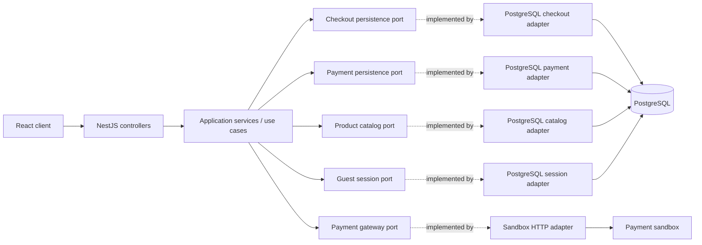

# Hexagonal architecture

The API follows a pragmatic Ports and Adapters structure. HTTP, PostgreSQL, and the payment provider sit at the edges; application services coordinate checkout and payment behavior through contracts owned by the application.

## Dependency rule

- Controllers are inbound HTTP adapters. They validate transport input, call an application service, and serialize the result.
- Application services own workflow decisions: checkout idempotency, price calculation, payment-attempt lifecycle, reconciliation policy, and fulfillment transitions. They depend on TypeScript ports, not `DatabaseService`, `pg`, SQL, or PostgreSQL row models.
- PostgreSQL adapters implement those ports. SQL, row mapping, locks, conditional updates, and unit-of-work details stay there. Nest modules bind each port token to its adapter.
- The payment gateway contract is an outbound port. Its HTTP adapter performs provider calls; payment orchestration calls it outside database transactions.
- The database module provides transaction boundaries. Adapters expose semantic operations over a transaction-scoped unit of work rather than leaking `PoolClient` into application services.
- ESLint rejects `pg` and direct database-module imports from application services and HTTP controllers, protecting the dependency boundary during later changes.

## Two different consistency guarantees

PostgreSQL transactions, row locks, unique constraints, and conditional updates protect local invariants such as inventory counters, reservation transitions, checkout snapshots, and one-time fulfillment. These guarantees apply only to local database work.

Domain idempotency defines what repeating a client command means. A scoped key and request fingerprint return the original checkout/attempt or reject a changed payload. The provider is outside PostgreSQL's transaction, so a timeout remains an unknown outcome: it is reconciled before another attempt can be sent. Neither a unique database key nor the provider reference makes a remote charge exactly-once.

## Transaction boundary

1. Start a local transaction and reserve inventory / persist the payment attempt.
2. Commit the local transaction.
3. Call the provider through the gateway port, with no SQL transaction open.
4. Persist the response or preserve `UNKNOWN_OUTCOME` for reconciliation.

Only a verified approval commits held inventory and creates fulfillment, within a new local transaction.

## Scope and limitations

This is a NestJS application using Hexagonal Architecture at its application-to-persistence and application-to-provider boundaries. NestJS still supplies dependency-injection decorators, configuration access, scheduling, and HTTP exception types in some application services. Removing those framework conveniences from the use-case layer would be a separate purity refinement; it is not needed for PostgreSQL or provider replacement to remain behind ports.

The architecture does not change the schema, payment states, inventory policy, provider behavior, or deployed AWS resources. This iteration is local code and documentation until its PR is reviewed, merged, and deliberately deployed.
