# Payment, reservation, and recovery lifecycle

This document makes the challenge's ambiguous failure behavior explicit. It is a proposed domain policy for user validation, not a claim that every behavior is mandated by the challenge or guaranteed by the payment provider.

## Two different kinds of consistency

**Database consistency** is local to PostgreSQL. Transactions, unique constraints, foreign keys, checks, conditional updates, and row locks make a local state change atomic and safe under concurrent requests. For a reservation, decrement availability only when enough units remain, and write the reservation and checkout in the same database transaction.

**Domain idempotency** is the API/business promise for repeating a command. Within a defined scope, the same idempotency key and same canonical request return the same checkout or attempt; reusing that key with different input returns a conflict. Replayed webhooks or approval commands cannot commit a reservation or create fulfillment twice. A `UNIQUE` index supports this promise, but it does not by itself specify the response or lifecycle.

Neither guarantee makes PostgreSQL atomic with an external payment request. A SQL transaction must be closed before calling the provider. A reference, database outbox, or local transaction is not an exactly-once guarantee for a remote side effect.

## Resources and states

| Resource | Proposed states | Allowed terminal/local transitions |
|---|---|---|
| Checkout | `RESERVED`, `PAYMENT_PENDING`, `PAID`, `PAYMENT_FAILED`, `CANCEL_PENDING`, `CANCELLED`, `EXPIRED`, `FULFILLMENT_EXCEPTION` | `PAID` is reached only on confirmed approval. `CANCELLED`/`EXPIRED` close new payment attempts. A late approval after release becomes an exception, not a stock adjustment against another buyer. |
| Reservation | `HELD`, `COMMITTED`, `RELEASED` | Exactly one transition from `HELD` to `COMMITTED` or `RELEASED`. |
| Payment attempt | `CREATED`, `DISPATCHING`, `PENDING`, `UNKNOWN_OUTCOME`, `APPROVED`, `DECLINED`, `ERROR`, `VOIDED` | Provider-terminal states are immutable evidence for that attempt. A new deliberate attempt is a new resource with a new local key, provider reference, and card token. |
| Fulfillment | `READY`, `FULFILLMENT_EXCEPTION`, `CANCELLED` | Create at most once after confirmed approval. Actual delivery/shipping integration is outside the challenge baseline unless required by the brief. |

```mermaid
stateDiagram-v2
    [*] --> RESERVED: checkout + atomic stock hold
    RESERVED --> PAYMENT_PENDING: provider says PENDING
    RESERVED --> UNKNOWN_OUTCOME: timeout after send may have begun
    RESERVED --> EXPIRED: no payment attempt before hold expiry
    PAYMENT_PENDING --> PAID: confirmed APPROVED
    PAYMENT_PENDING --> PAYMENT_FAILED: confirmed DECLINED or ERROR
    PAYMENT_PENDING --> CANCEL_PENDING: explicit cancel/void requested
    PAYMENT_PENDING --> UNKNOWN_OUTCOME: provider status cannot be established
    UNKNOWN_OUTCOME --> PAYMENT_PENDING: reconciliation says PENDING
    UNKNOWN_OUTCOME --> PAID: reconciliation confirms APPROVED
    UNKNOWN_OUTCOME --> PAYMENT_FAILED: reconciliation confirms terminal failure
    UNKNOWN_OUTCOME --> FULFILLMENT_EXCEPTION: approval arrives after stock release
    PAYMENT_FAILED --> RESERVED: explicit eligible retry, new attempt
    PAYMENT_FAILED --> EXPIRED: retry window closes; release hold once
    CANCEL_PENDING --> CANCELLED: provider confirms terminal cancellation
    PAID --> FULFILLMENT_EXCEPTION: fulfillment fails after approval
```

The diagram is a review model, not executable state-machine code. `VOIDED` maps to checkout cancellation only when it corresponds to an explicit cancel/void command. An unexpected `VOIDED` result is reconciled and reviewed before deciding whether another attempt is permitted.

## Recommended request and payment sequence

1. The API validates the product and computes the authoritative price/fee snapshot in integer COP minor units.
2. One PostgreSQL transaction creates the checkout, scoped idempotency record, price snapshot, and `HELD` reservation using a conditional stock update/lock. Any failed write rolls back the whole local operation.
3. The frontend obtains the latest provider acceptance tokens, displays both applicable consent texts, and obtains explicit acceptance. It tokenizes card details directly with the provider's public tokenization key. PAN and CVC never reach or persist in this application. Each deliberate payment attempt uses a fresh card token.
4. A second short PostgreSQL transaction inserts the payment attempt and unique per-attempt provider reference, then commits. The API calls the provider only after that transaction has closed, with the private API key held server-side. The API calculates any integrity signature from the stored amount/reference/currency; it does not accept a client total or client-generated signature as authoritative.
5. A provider response of `PENDING` remains pending. A browser redirect or a successful HTTP response from the provider is not proof of payment. The API returns local checkout/attempt identifiers, and the frontend reads its status from this API.
6. A signed provider event or a server-side status reconciliation validates the current provider transaction and applies an idempotent transition. Persist a minimal durable event receipt before returning success to the provider. Duplicate/out-of-order events must be harmless; when the event is stale or contradictory, query the provider server-side if a transaction ID is known.

The selected synchronous dispatch keeps a short-lived card token in memory and avoids persisting it in an outbox. The attempt is durable before dispatch. If implementation needs asynchronous dispatch, first design approved short-lived encrypted token handling and deletion; do not quietly put a card token in a general-purpose queue or logs. An outbox may still be used for local post-approval work, but it cannot make the provider call exactly once.

## What to do when a payment appears to fail

| Evidence | Domain decision | Stock and next attempt |
|---|---|---|
| Local validation fails before dispatch could start | Reject the command and retain useful validation state; do not create a provider transaction. | Existing hold stays until its normal expiry. The same corrected command may be resubmitted under a new command key if its payload changes. |
| The provider returns a confirmed terminal `DECLINED` or `ERROR` | Close that attempt as failed; preserve the response and correlation evidence. | Offer only the bounded explicit retry while the hold remains eligible. New attempt means a fresh token and new reference. |
| The provider returns `PENDING` | Keep the attempt open and show a pending state. | Keep the hold; do not start another payment attempt. Poll the app's status endpoint and accept signed events. |
| Network timeout/crash after sending may have begun | Mark `UNKNOWN_OUTCOME`; timeout is not decline. Preserve attempt/reference and reconcile by webhook or provider status lookup when provider transaction ID is known. | Keep the hold and block another charge. Never automatically resend the same attempt. If no transaction ID/event can resolve it, surface it for explicit operational review. |
| Provider event/status confirms `APPROVED` | Commit reservation and create one fulfillment record in one local transaction. | No retry. A fulfillment failure is a fulfillment exception, never a reason to charge again. |
| Explicit cancellation requested while payment is open | Request supported provider void/cancellation and enter `CANCEL_PENDING`. | Keep stock held until a confirmed terminal result. Do not label a pending cancellation as canceled. |
| Provider confirms `VOIDED` for that cancellation | Close the attempt and checkout as cancelled. | Release the hold once. A canceled checkout cannot be retried; user starts a new checkout. |
| Approval arrives after hold was released/reassigned | Persist the approval and raise `FULFILLMENT_EXCEPTION`; do not steal stock from another reservation. | Human/business decision: acquire stock without violating another hold or arrange compensation/refund. Refund is a separate provider operation, not an automatic consequence of timeout. |

An attempt that is unresolved is **recovered/reconciled**, not annulled. A confirmed decline/error can lead to a deliberate new attempt. A confirmed cancellation/void closes the checkout. A refund addresses a payment already approved; it is a different lifecycle. These distinctions are the recommended answer to the brief's underspecified “failed transaction” behavior.

## Provider facts relevant to the boundary

The current official integration documents reviewed on 2026-09-24 describe: browser-side encrypted card tokenization; separate acceptance tokens for applicable data/terms consent; server-side transaction creation initially returning `PENDING`; terminal `APPROVED`, `DECLINED`, `VOIDED`, and `ERROR` results; status lookup by provider transaction ID; and signed transaction events. The event signature uses the event's documented property list/order, timestamp, and a separate event secret. Invalid webhook delivery is retried by the provider, so the receiver must tolerate redelivery.

The docs require unique transaction references but do not describe that field as an idempotency key. A duplicate-reference error is not a replayed success. The documented status lookup requires a provider transaction ID, so an unknown outcome with no ID and no event may need operational review. Recheck the live sandbox contract in I3 before implementing the adapter; do not copy any shared challenge credentials to the repo.

## Provisional demo policy for the I0 gate

- Hold inventory for 10 minutes if checkout has no dispatched payment attempt.
- Permit at most one explicit retry, for 10 minutes after a confirmed terminal non-approved result.
- A pending or unknown attempt does not auto-expire into another charge. Keep stock held pending reconciliation; escalate old unresolved cases for review.
- Calculate configured base/delivery fees server-side; exact values and customer/address fields remain to be confirmed from the challenge flow.

These durations, retry count, and escalation behavior are product assumptions. Ask the user to approve or revise them before I2/I3 implements expiration or retry UI.
