# Payment, reservation, and recovery lifecycle

This document makes the challenge's ambiguous failure behavior explicit. It is a proposed domain policy for user validation, not a claim that every behavior is mandated by the challenge or guaranteed by the payment provider.

## Two different kinds of consistency

**Database consistency** is local to PostgreSQL. Transactions, unique constraints, foreign keys, checks, conditional updates, and row locks make a local state change atomic and safe under concurrent requests. For a reservation, decrement availability only when enough units remain, and write the reservation and checkout in the same database transaction.

**Domain idempotency** is the API/business promise for repeating a command. Within a defined scope, the same idempotency key and same canonical request return the same checkout or attempt; reusing that key with different input returns a conflict. Replayed webhooks or approval commands cannot commit a reservation or create fulfillment twice. A `UNIQUE` index supports this promise, but it does not by itself specify the response or lifecycle.

Neither guarantee makes PostgreSQL atomic with an external payment request. A SQL transaction must be closed before calling the provider. A reference, database outbox, or local transaction is not an exactly-once guarantee for a remote side effect.

## Resources and states

| Resource | Proposed states | Allowed terminal/local transitions |
|---|---|---|
| Checkout | `RESERVED`, `PAYMENT_PENDING`, `PAID`, `PAYMENT_FAILED`, `CANCEL_PENDING`, `CANCELLED`, `EXPIRED`, `FULFILLMENT_EXCEPTION` | `PAID` is reached only on confirmed approval. `CANCELLED`/`EXPIRED` close new payment attempts. A late approval after release becomes an exception, not a stock adjustment against another buyer. |
| Reservation | `HELD`, `COMMITTED`, `RELEASED` | Exactly one transition from `HELD` to `COMMITTED` or `RELEASED`. |
| Payment attempt | `CREATED`, `DISPATCHING`, `FAILED_LOCAL`, `REJECTED_NO_TRANSACTION`, `PENDING`, `UNKNOWN_OUTCOME`, `APPROVED`, `DECLINED`, `ERROR`, `VOIDED` | `FAILED_LOCAL` means the adapter proves no request bytes were sent. `REJECTED_NO_TRANSACTION` records an explicit provider rejection before transaction creation. Neither consumes a provider charge retry. Repeated observations cannot downgrade a newer result; a newer contradiction after approval triggers manual review. A deliberate retry is a new resource with a new local key, provider reference, and card token. |
| Fulfillment | `READY`, `FULFILLMENT_EXCEPTION`, `CANCELLED` | Create at most once after confirmed approval. Actual delivery/shipping integration is outside the challenge baseline unless required by the brief. |

```mermaid
stateDiagram-v2
    [*] --> RESERVED: checkout + atomic stock hold
    RESERVED --> PAYMENT_PENDING: provider says PENDING
    RESERVED --> UNKNOWN_OUTCOME: timeout after send may have begun
    RESERVED --> RESERVED: mark attempt FAILED_LOCAL when no request bytes were sent
    RESERVED --> RESERVED: provider rejects request before transaction creation
    PAYMENT_PENDING --> RESERVED: explicit provider rejection before transaction creation
    RESERVED --> EXPIRED: no payment attempt before hold expiry
    PAYMENT_PENDING --> PAID: confirmed APPROVED
    PAYMENT_PENDING --> PAYMENT_FAILED: confirmed DECLINED or ERROR
    PAYMENT_PENDING --> UNKNOWN_OUTCOME: provider status cannot be established
    UNKNOWN_OUTCOME --> PAYMENT_PENDING: reconciliation says PENDING
    UNKNOWN_OUTCOME --> PAID: reconciliation confirms APPROVED
    UNKNOWN_OUTCOME --> PAYMENT_FAILED: reconciliation confirms terminal failure
    UNKNOWN_OUTCOME --> FULFILLMENT_EXCEPTION: approval arrives after stock release
    PAYMENT_FAILED --> PAYMENT_PENDING: explicit eligible retry, new attempt
    PAYMENT_FAILED --> EXPIRED: retry window closes; release hold once
    PAID --> FULFILLMENT_EXCEPTION: fulfillment fails after approval
```

The diagram is a review model, not executable state-machine code. I3 has no public cancellation command; a confirmed `VOIDED` result closes the checkout and releases its held stock.

For mutations to an existing checkout, transactions acquire row locks in a consistent order: **checkout → reservation → payment attempt → product**. Expiry first discovers candidate IDs without locking, then locks the checkout and revalidates/locks its reservation before adjusting the product counter. This keeps expiry, payment events, reconciliation, and explicit payment commands from waiting on the same checkout/reservation rows in opposite orders.

## Recommended request and payment sequence

1. The API validates the product and computes the authoritative price/fee snapshot in integer COP minor units.
2. One PostgreSQL transaction creates the checkout, scoped idempotency record, price snapshot, and `HELD` reservation using a conditional stock update/lock. Any failed write rolls back the whole local operation.
3. The frontend obtains the current terms and personal-data authorization tokens, shows both applicable consent texts, and obtains explicit acceptance for both. It tokenizes card details directly with the provider's public tokenization key. PAN and CVC never reach or persist in this application. Each deliberate payment attempt uses a fresh card token.
4. A short PostgreSQL transaction checks checkout/session ownership, reservation eligibility, attempt history and idempotency, inserts the attempt and unique per-attempt reference, changes the checkout to `PAYMENT_PENDING`, then commits. The API calls the provider only after that transaction has closed, with the private API key held server-side. The API calculates the integrity signature from the stored amount/reference/currency; it does not accept a client total or client-generated signature as authoritative.
5. Internal amounts use whole COP values; only the provider adapter converts them to centavos. A provider response of `PENDING` remains pending. A browser redirect or a successful HTTP response from the provider is not proof of payment. The API returns local checkout/attempt identifiers, and the frontend reads its status from this API.
6. A signed provider event or a server-side status reconciliation validates the current provider transaction and applies an idempotent transition. Persist a minimal durable event receipt before returning success to the provider. Duplicate/out-of-order events must be harmless. A newer contradictory terminal status after approval preserves the committed local state and sets `manualReviewRequired`; it does not silently reverse fulfillment.

The selected synchronous dispatch keeps a short-lived card token and both consent tokens in memory and avoids persisting them in an outbox. PostgreSQL stores only a request fingerprint hash to recognize an identical replay; the 30-day PII-retention job removes that hash. The attempt is durable before dispatch. If implementation needs asynchronous dispatch, first design approved short-lived encrypted token handling and deletion; do not quietly put a card token in a general-purpose queue or logs. An outbox may still be used for local post-approval work, but it cannot make the provider call exactly once.

## What to do when a payment appears to fail

| Evidence | Domain decision | Stock and next attempt |
|---|---|---|
| Local validation fails before an attempt is created | Reject the command and retain useful validation state; do not create a provider transaction. | Existing hold stays until its normal expiry. The corrected request may be submitted once valid. |
| Transport evidence proves no provider request bytes could have been sent | Close the attempt as `FAILED_LOCAL`, recording why it is known not to have reached the provider. | Permit a deliberate new attempt with a new key and fresh card token; this does not consume the proposed retry reserved for a provider-terminal failure. |
| Provider explicitly rejects the create request with a documented `400`/`401` response before creating a transaction | Close the attempt as `REJECTED_NO_TRANSACTION` and retain the response code; do not report a card decline or consume the provider-terminal retry. | Keep the reservation through its existing deadline and permit a deliberate corrected request with a new key/token. |
| The provider returns a confirmed terminal `DECLINED` or `ERROR` | Close that attempt as failed; preserve status and correlation evidence. | After the first provider-terminal failure, start a 10-minute window for one explicit retry with a fresh token, key, and reference. If that retry also fails, release the hold immediately. If unused, the retry window expiry releases the hold. |
| The provider returns `PENDING` | Keep the attempt open and show a pending state. | Keep the hold; do not start another payment attempt. Poll the app's status endpoint and accept signed events. |
| Network timeout/crash after sending may have begun | Mark `UNKNOWN_OUTCOME`; timeout is not decline. Preserve attempt/reference and reconcile by webhook or server-side status lookup when the provider transaction ID is known. A crashed `DISPATCHING` row is eligible for recovery after 20 seconds and becomes unknown on the next 30-second reconciliation pass. | Keep the hold and block another charge. Never automatically resend the same attempt. At the provisional 30-minute threshold, expose `manualReviewRequired`; do not automatically release or retry. |
| Provider event/status confirms `APPROVED` | Commit a still-valid hold and create one fulfillment record in one local transaction. A late approval after release or after the `PAYMENT_FAILED` retry deadline becomes `FULFILLMENT_EXCEPTION`; release any still-held expired stock first. Pending/unknown attempts retain their hold while reconciliation is open. | No retry. A fulfillment failure is a fulfillment exception, never a reason to charge again. |
| Provider confirms `VOIDED` | Close the attempt and checkout as cancelled. I3 has no public cancellation command; this result may follow a provider-side operation or event. | Release the hold once. A canceled checkout cannot be retried; user starts a new checkout. |
| Approval arrives after hold was released/reassigned or after a `PAYMENT_FAILED` retry deadline | Persist the approval and raise `FULFILLMENT_EXCEPTION`; release any still-held expired quantity and do not steal stock from another reservation. | Human/business decision: acquire stock without violating another hold or arrange compensation/refund. Refund is a separate provider operation, not an automatic consequence of timeout. |

An attempt that is unresolved is **recovered/reconciled**, not annulled. A confirmed decline/error can lead to one deliberate new attempt. A confirmed cancellation/void closes the checkout. A refund addresses a payment already approved; it is a different lifecycle. These distinctions answer the brief's underspecified “failed transaction” behavior.

## Provider facts relevant to the boundary

The current official integration documents rechecked on 2026-09-24 describe: browser-side card tokenization; separate acceptance tokens for privacy and personal-data authorization; integer `amount_in_cents`; server-side transaction creation initially returning `PENDING`; terminal `APPROVED`, `DECLINED`, `VOIDED`, and `ERROR` results; status lookup by provider transaction ID with the private key; and signed transaction events. The event signature uses the event's documented property list/order, timestamp, and a separate event secret. Non-`200` webhook delivery may be retried up to three times during the next 24 hours, so this receiver tolerates redelivery and returns `200` only after verifying and durably recording an event.

The docs require unique transaction references but do not describe that field as an idempotency key. A duplicate-reference error is not a replayed success. The documented status lookup requires a provider transaction ID, so an unknown outcome with no ID and no event may need operational review. The adapter treats transport failures and ambiguous non-`400`/`401` responses conservatively as unknown. No live sandbox keys have been supplied; I3 tests use a controlled provider double, not a real charge.

## I3 implementation defaults awaiting user validation

- An unresolved payment older than 1,800 seconds is flagged for manual review by default. Set the threshold to `0` to disable automatic escalation. The flag is visible to the owning guest; it neither releases stock nor authorizes another charge. An operator reconciles using the persisted provider reference/transaction ID and the payment dashboard. I3 has no admin UI.
- Minimal event receipts are retained for 365 days by default, then deleted in batches. They contain only fingerprint, attempt link, transaction ID/reference, status, amount/currency, event/received times, and disposition; no full event body or card data is stored.
- Both defaults are configurable through `PAYMENT_UNRESOLVED_REVIEW_THRESHOLD_SECONDS` and `PAYMENT_EVENT_RECEIPT_RETENTION_DAYS`. They remain provisional until the user validates the I3 PR.

The 10-minute initial hold and single explicit retry after confirmed decline/error remain the user-approved baseline. If transport evidence cannot prove the request stayed local, use `UNKNOWN_OUTCOME`, not `FAILED_LOCAL`.
